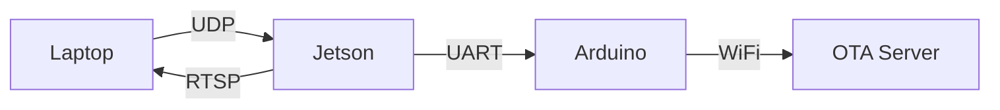

# System Architecture

## Overview
The RC Vehicle Immersive project implements a distributed control system for an RC vehicle with real-time video streaming and immersive control capabilities.

## System Components

### 1. Control Station (Laptop)
- **Hardware**
  - Laptop with WiFi capability
  - Logitech G29 Racing Wheel
  - Display for video feed

- **Software Components**
  - Joystick Control Module
    - Reads input from G29
    - Processes and normalizes control signals
    - Sends UDP packets to Jetson
  - Video Viewer
    - Receives RTSP stream
    - Displays video feed
    - Adds overlays (timestamp, status)

### 2. Vehicle Control Unit (Jetson Nano)
- **Hardware**
  - NVIDIA Jetson Nano
  - Raspberry Pi Camera v2
  - UART connection to Arduino

- **Software Components**
  - UDP Receiver
    - Listens for control signals
    - Processes and validates data
    - Forwards to Arduino
  - Video Streaming
    - Captures camera feed
    - Encodes video (H.264)
    - Streams via RTSP

### 3. Motor Control Unit (Arduino Nano ESP32)
- **Hardware**
  - Arduino Nano ESP32
  - Servo for steering
  - Status LED
  - WiFi connectivity

- **Software Components**
  - Serial Command Parser
    - Receives UART commands
    - Validates and processes data
  - Servo Controller
    - Generates PWM signals
    - Controls steering servo
  - WiFi Manager
    - Handles WiFi connection
    - Supports OTA updates
  - Status Monitor
    - LED feedback
    - Error reporting

## Communication Architecture

### Control Flow


### Data Formats

#### UDP Control Packets
```
Format: "<steering>,<throttle>\n"
Example: "50,-30\n"
- steering: -100 to 100
- throttle: -100 to 100
```

#### UART Commands
```
Format: "S<angle>\n"
Example: "S90\n"
- angle: 0 to 180 degrees
```

#### Video Stream
- Protocol: RTSP
- Codec: H.264
- Resolution: 640x480
- Frame Rate: 30 FPS

## Future Extensions

### 1. VR Integration
- Unity-based VR interface
- WebRTC for low-latency streaming
- Head tracking for camera control

### 2. Autonomous Features
- Object detection
- Path planning
- Obstacle avoidance

### 3. Telemetry
- Battery monitoring
- Speed/position tracking
- System status reporting
- WiFi signal strength monitoring

## Security Considerations

### Network Security
1. Use private WiFi network
2. Implement authentication for control signals
3. Encrypt video stream
4. Regular security updates
5. Secure OTA updates
6. Protect WiFi credentials

### System Safety
1. Emergency stop functionality
2. Battery monitoring
3. Connection loss handling
4. Fail-safe modes
5. Servo position limits
6. OTA update verification

## Performance Considerations

### Latency
- Target control latency: <100ms
- Video streaming latency: <200ms
- Total system latency: <300ms
- OTA update time: <60s

### Bandwidth
- Control signals: ~1KB/s
- Video stream: ~2MB/s
- OTA updates: ~100KB/s
- Total bandwidth: ~2.1MB/s

### Processing
- Jetson Nano CPU usage: <80%
- Arduino processing time: <10ms
- Laptop CPU usage: <50%
- WiFi connection stability: >99%

## Development Guidelines

### Code Organization
1. Modular design
2. Clear separation of concerns
3. Comprehensive error handling
4. Detailed logging
5. Configuration management
6. Secure credential handling

### Testing
1. Unit tests for each module
2. Integration tests for communication
3. System tests for full functionality
4. Performance benchmarks
5. OTA update testing
6. WiFi stability testing

### Documentation
1. Code documentation
2. API documentation
3. Hardware documentation
4. User guides
5. Security guidelines
6. OTA update procedures 